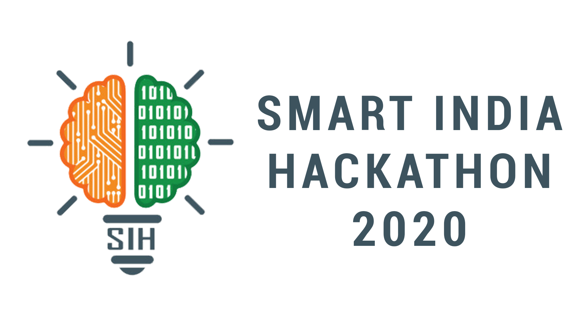

# My SIH Project

# Ankuran

Low cost and affordable smart autonomous remote monitored agriculture system of seed sowing with depth and spacing control.

The problem caused  due to traditional seed sowing method  is that the depth of seed sown and spacing between them  is inaccurate  which cause decrease in crop yield and wastage of seed.
To overcome this we design a bot which sows the seed in desired depth and maintain the spacing between two plants which results increase in yield.
The depth required for various seeds are different so thus we developed an app called “ANKURAN” in which the data of depth and spacing required for each and every seed are stored. Thus by selecting the seed type in the app , the bot will start sowing  seed  in desired depth and spacing between two seeds will maintained.

# Android App

# Component Used

•	Arduino Mega 2560 Controlling Board

•	IC-L298N motor driver module

•	DC motors

•	12V DC battery

•	Servo motor

•	HC-05 Bluetooth Module

•	HC-SR04 Ultrasonic Sensor modules – to detect obstacles if any

# Design of Ankuran 

          

# Circuit Design

## Contributors

- Ritesh Anand <riteshms486@gmail.com>

## License & copyright

© Ritesh Anand

---

Licensed under the [MIT License](LICENSE).
